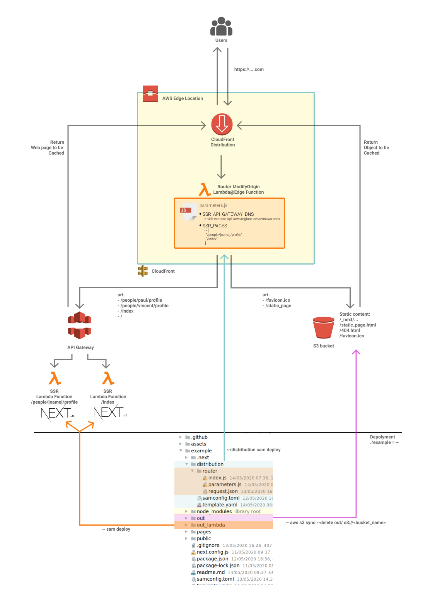

# 1) Install Api Gateway (SSR Rendering)

Requirement : An aws account with [aws sam](https://docs.aws.amazon.com/serverless-application-model/latest/developerguide/serverless-sam-cli-install.html)
installed.

In the example folder, install :
```
$> npm install
```

You can check on your browser if all works.
```
$> npm run dev
```

Build for serverless and generate `out_lambda` directory.
```
$> npm run build
```

Deployment for the first time and create `samconfig.yaml` file. Follow the guide line and
choose the regions of your choice.
```
$> sam deploy --guided
```
After you can use `sam deploy` without `--guided`.

# 2) Install CloudFront Distribution (Routing And Static Rendering)

First we have to configure ./distribution/router/parameters.js

```js
exports.SSR_API_GATEWAY_DNS = '<id>.execute-api.<region>.amazonaws.com';
exports.SSR_PAGES = [
 '/people/[name]/profile',
 '/index'
]
```

- **SSR_API_GATEWAY_DNS** : [This is a REST APIs endpoint of Amazon API Gateway](https://docs.aws.amazon.com/apigateway/latest/developerguide/how-to-call-api.html).
You can get this one with the following command (take care to specified your `region` and your `stack-name` of api gateway stack that you have specified before).
``` 
$> aws --region <region> cloudformation describe-stacks --stack-name <stack-name> --query 'Stacks[0].Outputs[?OutputKey==`ApiURL`].OutputValue' --output text
```
Now we have retrive the domain dns, you can edit `SSR_API_GATEWAY_DNS` in `parameters.js`
- **SSR_PAGES** : This is the whitelist of pages that will routing to api gateway for SSR Rendering.

Seconds go to the `distribution` folder, and deploy the project with `sam` on `us-east-1` aws region :
it's mandatory for deploy lambda@edge function.
```
$> cd distribution
$> sam deploy --guided
``` 
:point_right: When you update the `router` lambda@edge (ex: edit `parameters.js`) you must update the version 
in the CloudFormation template : `./distribution/template.yaml` 
`CloudfrontRouterVX` version -> ex `CloudfrontRouterV8` -> `CloudfrontRouterV9`.

Now we have to sync static assets, come back to the example folder `cd ..`.

Generate the static export.
```
$> npm run export
```
Retrieve the s3 bucket of the distribution stack. Type this command :  
```
$> aws --region us-east-1 cloudformation describe-stacks --stack-name <stack-name> --query 'Stacks[0].Outputs[?OutputKey==`BucketName`].OutputValue' --output text
``` 
Now we have the bucket name, we can sync the `out/` generate by NextJS.
```
$> aws s3 sync --delete out/ s3://<bucket_name>
```
:point_right: For the most deployment the s3 synchronisation have to be executed.


---
For **Reset** the project :
```
$> npm run raz
```
That delete all generated file (_sam configuration included_).

