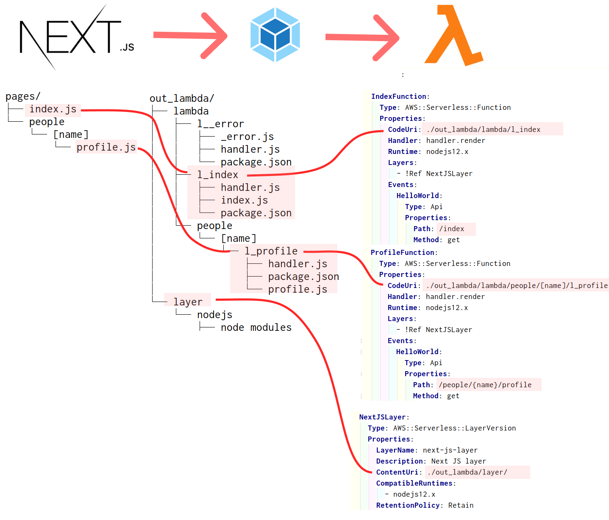

# next-aws-lambda-webpack-plugin

[](https://www.npmjs.com/package/next-aws-lambda-webpack-plugin)
[](https://github.com/vincent-herlemont/next-aws-lambda-webpack-plugin/actions?query=workflow%3A%22integration+test%22)

This plugin will generate aws-lambda compatible function for each [Next.JS pages](https://nextjs.org/docs/basic-features/pages). 
After that, you can to use functions with the [AWS cloudformation template](https://aws.amazon.com/cloudformation/resources/templates/) or/and [AWS serverless template](https://docs.aws.amazon.com/serverless-application-model/latest/developerguide/what-is-sam.html).

This plugin use [next-aws-lambda](https://github.com/danielcondemarin/serverless-next.js/tree/master/packages/next-aws-lambda) package,
 create by and for the [serverless](https://serverless.com/) community :heart:.

[](https://www.npmjs.com/package/next-aws-lambda-webpack-plugin)


### Requirement

1. Use [Next.JS](https://nextjs.org/docs/getting-started) CLI for build your project (`next build`)
    * The configuration file [next.config.js](https://nextjs.org/docs/api-reference/next.config.js/build-target) must use `target: 'serverless'`.
2. Use [SAM](https://docs.aws.amazon.com/serverless-application-model/latest/developerguide/what-is-sam.html) or [AWS CLI cloudformation](https://docs.aws.amazon.com/cli/latest/reference/cloudformation/index.html) for your deployment. 

# Install

Use npm :
```
npm install next-aws-lambda-webpack-plugin
```

### Configuration

Add the plugin to the Next.JS ([next.config.js](https://nextjs.org/docs/api-reference/next.config.js/custom-webpack-config)) configuration file.

| Plugin Arguments    |Required       |Description|
| ------------------- |:-------------:|-----------|
| dev                 | YES           | from#[next.config.js](https://nextjs.org/docs/api-reference/next.config.js/custom-webpack-config) - Indicates if the compilation will be done in development         |
| isServer            | YES           | from#[next.config.js](https://nextjs.org/docs/api-reference/next.config.js/custom-webpack-config) - It's true for server-side compilation, and false for client-side compilation          |
| options             | NO            | [see options](#options) |

Example:
```Javascript
const AwsLambdaGenerator = require('next-aws-lambda-webpack-plugin');

module.exports = {
    target: 'serverless',
    webpack: (config, {dev,isServer}) => {
        config.plugins.push(new AwsLambdaGenerator(dev,isServer));
        return config
    },
};
```

#### Options

| Plugin Options | Required | Default      | Description                            |
| -------------- | -------- | ----------   | -------------------------------------  |
| distDir        | No       | "out_lambda" | Custom lambda build directory.         |
| prefix         | No       | "l"          | Prefix apply to each lambda directory. |

Example:
```Javascript
new AwsLambdaGenerator(dev,isServer,{
    distDir: 'lambda_build'
})
```


### Example


([see](https://github.com/vincent-herlemont/next-aws-lambda-webpack-plugin/tree/master/example)) TODO
